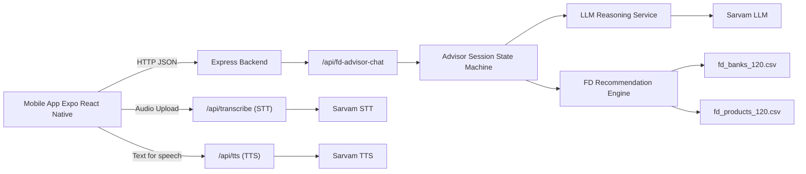

# Vernacular FD Advisor

Vernacular FD Advisor is a multilingual fixed-deposit assistant for India.
It includes:

- a Node.js backend for chat flow, recommendations, STT, and TTS
- an Expo React Native mobile app for voice and text conversations

## Project Overview

This project helps users discover suitable fixed-deposit options in their preferred language through a conversational interface.
It is designed for accessibility-first financial guidance, especially for users who are more comfortable speaking than typing.

Core value:
- multilingual interaction for Indian users
- voice-first and text-first interaction modes
- practical FD recommendations using structured bank and product data

## How It Works

1. The user starts a conversation in the mobile app using voice or text.
2. If voice is used, speech is transcribed by the backend STT endpoint.
3. The advisor API tracks session context such as amount, tenure, and user preferences.
4. The backend recommendation engine evaluates FD products from CSV datasets and selects top options.
5. The LLM service converts recommendation data into a natural-language explanation in the selected language.
6. The response is returned to the app and optionally converted to speech using the TTS endpoint.
7. The user can continue the conversation, refine inputs, and receive updated recommendations.

## Supported Languages

| Language                | BCP-47 Code |
| ----------------------- | ----------- |
| Hindi                   | hi-IN       |
| Bengali                 | bn-IN       |
| Tamil                   | ta-IN       |
| Telugu                  | te-IN       |
| Kannada                 | kn-IN       |
| Malayalam               | ml-IN       |
| Marathi                 | mr-IN       |
| Gujarati                | gu-IN       |
| Punjabi                 | pa-IN       |
| Odia                    | od-IN       |
| English (Indian accent) | en-IN       |

## System Architecture

## Demo Video

 YouTube link: https://www.youtube.com/watch?v=REPLACE_WITH_DEMO_ID

## Setup

1. Install Node.js 18+.
2. Install dependencies in backend:
   - `npm install`
3. Install dependencies in mobile app:
   - `cd mobile-app`
   - `npm install`

## Start the Application

1. Start backend server from project root:
   - `npm run stt-server`
2. Start mobile app in a new terminal:
   - `cd mobile-app`
   - `npm run start`
3. Run on a target platform:
   - Android: `npm run android`
   - iOS: `npm run ios`
   - Web: `npm run web`

## Environment

Create a `.env` file in project root with required Sarvam credentials used by backend services.
